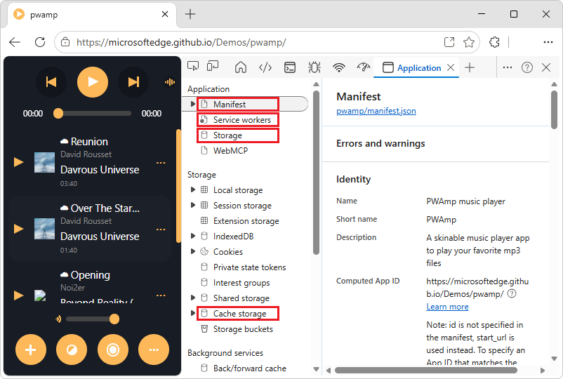
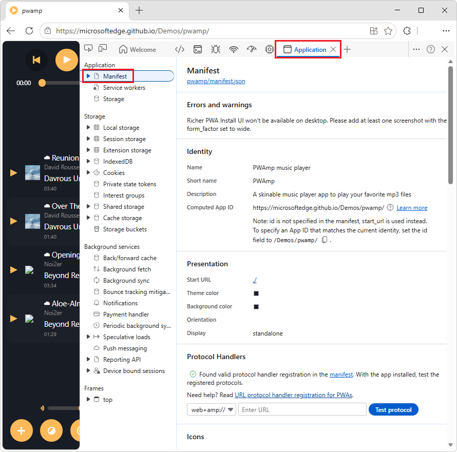
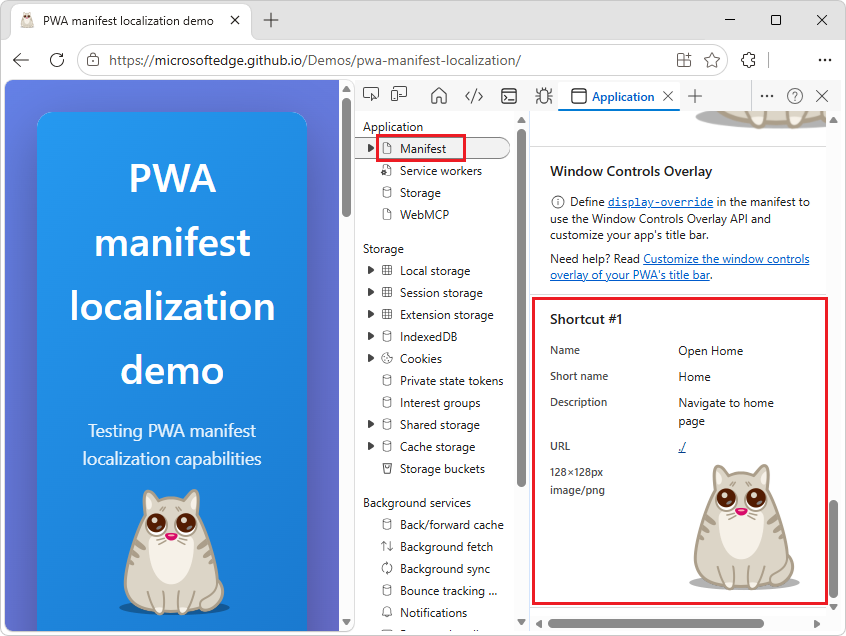
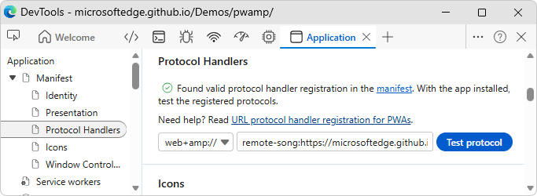
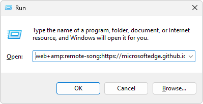
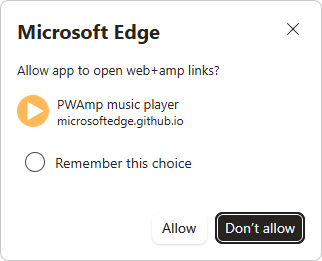
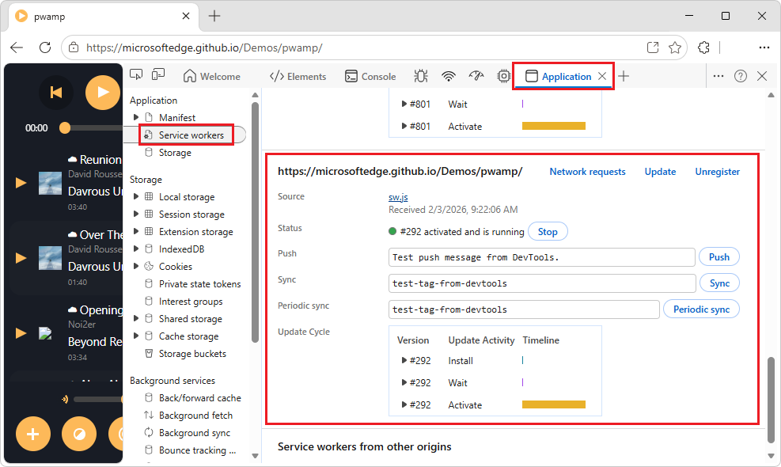
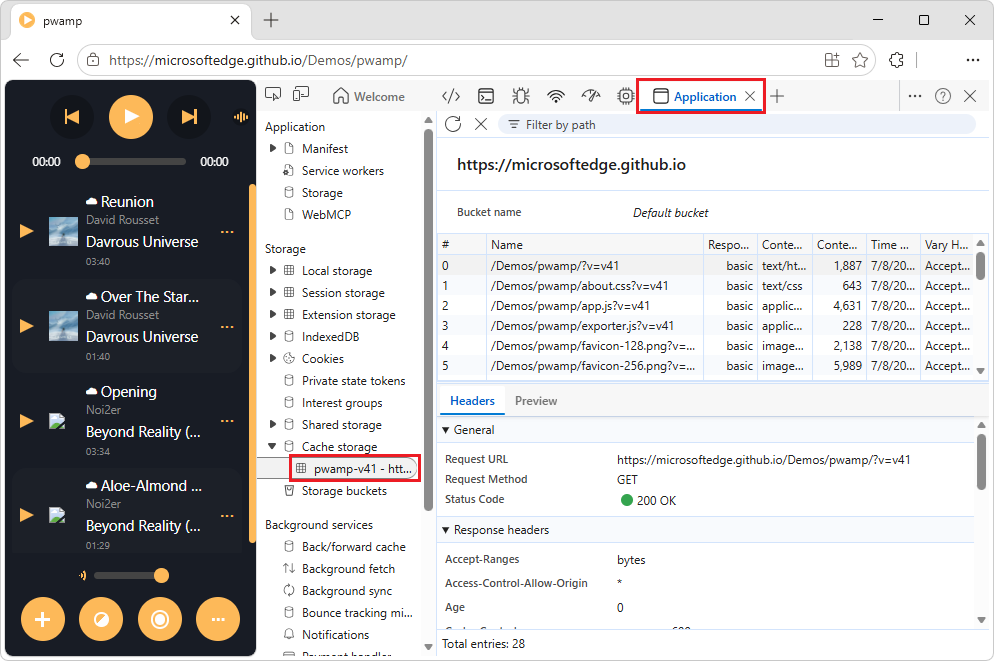
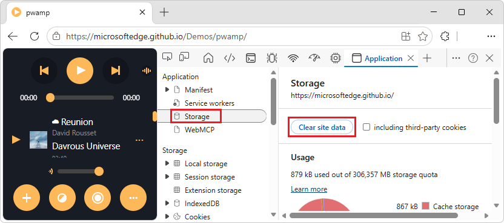

<!-- Copyright Kayce Basques

   Licensed under the Apache License, Version 2.0 (the "License");
   you may not use this file except in compliance with the License.
   You may obtain a copy of the License at

       https://www.apache.org/licenses/LICENSE-2.0

   Unless required by applicable law or agreed to in writing, software
   distributed under the License is distributed on an "AS IS" BASIS,
   WITHOUT WARRANTIES OR CONDITIONS OF ANY KIND, either express or implied.
   See the License for the specific language governing permissions and
   limitations under the License.  -->
# Debug a Progressive Web App (PWA)
<!-- https://learn.microsoft.com/microsoft-edge/devtools/progressive-web-apps/ -->
<!-- https://developer.chrome.com/docs/devtools/progressive-web-apps/ -->

Use the **Application** tool to inspect, modify, and debug a PWA's web app manifests, service workers, and service worker caches.

**Detailed contents:**
* [About Progressive Web Apps (PWAs)](#about-progressive-web-apps-pwas)
* [PWA-related pages in the Application tool](#pwa-related-pages-in-the-application-tool)
* [Web app manifest](#web-app-manifest)
   * [View and check maskable icons](#view-and-check-maskable-icons)
   * [Inspect shortcuts](#inspect-shortcuts)
   * [Test URL protocol handler registration](#test-url-protocol-handler-registration)
      * [Install the PWA](#install-the-pwa)
      * [Test URL protocol handler registration by using DevTools](#test-url-protocol-handler-registration-by-using-devtools)
      * [Test URL protocol handler registration by using the Run app](#test-url-protocol-handler-registration-by-using-the-run-app)
* [Service workers](#service-workers)
   * [UI controls in the Service workers page](#ui-controls-in-the-service-workers-page)
   * [Display network requests handled by a service worker](#display-network-requests-handled-by-a-service-worker)
* [Service worker caches (Cache storage page)](#service-worker-caches-cache-storage-page)
* [Clear storage (Storage page)](#clear-storage-storage-page)
* [See also](#see-also)


<!-- ------------------------------ -->
#### About Progressive Web Apps (PWAs)
<!-- heading not upstream; content from https://developer.chrome.com/docs/devtools/progressive-web-apps/ -->

Progressive Web Apps (PWAs) are modern, high-quality applications built using web technology.  PWAs offer similar capabilities to apps on iOS, Android, and desktop:

* PWAs are reliable even in unstable network conditions.
* PWAs are installable to launch-surfaces of operating systems, such as:
   * The **Applications** folder on Mac OS X.
   * The **Start** menu on Windows.
   * The home screen on Android and iOS.
* PWAs show up in:
   * Activity switchers.
   * Device search engines such as the Windows Start menu.
   * Sharing dialogs, such as when sharing files between apps.  A PWA can trigger share dialogs, and can also appear in share dialogs.  See [Share content with other apps](../../progressive-web-apps/how-to/share.md).

The features that are discussed below are features of the **Application** tool that are relevant for PWAs.  For help on the other features and pages in the **Application** tool, see:
* [See also](#see-also), below.
* [View the resource files that make up a webpage](../resources/index.md)
* [View and edit local storage](../storage/localstorage.md)

See also:
* [Overview of Progressive Web Apps (PWAs)](../../progressive-web-apps/index.md)


<!-- ====================================================================== -->
## PWA-related pages in the Application tool
<!-- Summary  https://developer.chrome.com/docs/devtools/progressive-web-apps/#summary -->

The  **Application** tool includes the following pages (accessed via the tree on the left) that cover PWA features:



* Use the **Manifest** page to inspect your web app manifest.  See [Web app manifest](#web-app-manifest), below.

* Use the **Service workers** page for service-worker-related tasks, such as:
  * Unregistering or updating a service.
  * Emulating push events.
  * Going offline.
  * Stopping a service worker.
  * Unregistering or updating a service worker.

  See [Service workers](#service-workers), below.

* Use the **Storage** page to view how much data your app is storing on the device, and clear the stored data.  See [Clear storage (Storage page)](#clear-storage-storage-page), below.

* Use the **Cache storage** page to view your service worker cache.  See [Service worker caches (Cache storage page)](#service-worker-caches-cache-storage-page), below.


<!-- ====================================================================== -->
## Web app manifest
<!-- https://developer.chrome.com/docs/devtools/progressive-web-apps/#manifest -->

To let users install your app, you need a web app manifest.

The web app manifest defines:
* The app icon and name, when installed on the device.
* Where to direct the user when launching the app from the device.
* What the app looks like when launched.

To inspect a manifest:

1. Go to a webpage that uses a web app manifest, such as [PWAmp](https://microsoftedge.github.io/Demos/pwamp/), in a new window or tab.

1. Right-click the webpage, and then select **Inspect**.

   DevTools opens.

1. In DevTools, select the  **Application** tool.

1. In the outline on the left, in the **Application** section, select **Manifest**.

   The **Manifest** page is displayed:

   

   The **Manifest** page contains the following sections:
   * **Manifest** - contains the manifest link.
   * **Errors and warnings**
   * **Identity** - displays fields from the manifest source file in a user-friendly display.
   * **Presentation** - displays fields from the manifest source file in a user-friendly display.
   * **Protocol Handlers**
   * **Icons** - displays every icon that's been specified in the manifest.
   * **Window Controls Overlay**
   * Optionally, screenshot sections, such as **Screenshot #1** and **Screenshot #2**.

1. Click the link below the **App Manifest** label, such as `manifest.json`.

   The manifest file opens, such as [/pwamp/manifest.json](https://microsoftedge.github.io/Demos/pwamp/manifest.json).

See also:
* [Use Progressive Web Apps (PWAs) in Microsoft Edge](../../progressive-web-apps/ux.md)
* [The web app manifest (`manifest.json`)](../../progressive-web-apps/how-to/index.md#the-web-app-manifest-manifestjson) in _Get started developing a PWA_.


<!-- ------------------------------ -->
#### View and check maskable icons
<!-- https://developer.chrome.com/docs/devtools/progressive-web-apps/#icons -->

The **Icons** section of the **Manifest** page of the **Application** tool displays all the icons of your application.  In the **Icons** section, you can also check safe areas for maskable icons, which is the format of icons that adapt to platforms.

To trim the icons so that only the minimum safe area is visible, select the **Show only the minimum safe area for maskable icons** checkbox:

<!-- https://microsoftedge.github.io/Demos/pwamp/ -->

If your entire logo is visible in the safe area, the formatting is valid.

See also:
* [Adaptive icon support in PWAs with maskable icons](https://web.dev/articles/maskable-icon) at web.dev.


<!-- ------------------------------ -->
<!-- #### Trigger installation -->
<!-- https://developer.chrome.com/docs/devtools/progressive-web-apps/#trigger-installation -->
<!-- omitted section b/c not related to debugging a PWA in DevTools.  explains how to install a PWA in Edge (covered in end-user doc'n) -->


<!-- ---------- -->
<!-- ###### Monitor the Console tool in the Quick view panel -->
<!-- heading not upstream; content is upstream -->
<!-- omitted section b/c obsolete, was useful when Application tool had a "simulate add to home screen" feature.  the App available button in the address bar of Edge doesn't appear if the app isn't installable, so there is no case where a user would try to install the app but installation would fail with messages in the Console tool -->


<!-- ---------- -->
<!-- ###### Test a mobile device -->
<!-- heading not upstream; content is upstream -->
<!-- omitted section -->


<!-- ------------------------------ -->
#### Inspect shortcuts
<!-- https://developer.chrome.com/docs/devtools/progressive-web-apps/#shortcut -->

App shortcuts let you to provide quick access to a handful of common actions that users need frequently.

To inspect the shortcuts that you defined in your manifest file, scroll to the **Shortcut #N** sections of the **Manifest** page in the **Application** tool.  The **Shortcut #N** sections are below the **Windows Control Overlay** section of the **Manifest** page:



The above screenshot is from the [PWA manifest localization demo](https://microsoftedge.github.io/Demos/pwa-manifest-localization/), which defines a shortcut in its manifest file.

See also:
* [Define app shortcuts (long-press or right-click menus)](../../progressive-web-apps/how-to/shortcuts.md)


<!-- ------------------------------ -->
<!-- #### Inspect screenshots for a richer installation UI -->
<!-- https://developer.chrome.com/docs/devtools/progressive-web-apps/#screenshot -->
<!-- omitted chrome-only section -->


<!-- ------------------------------ -->
#### Test URL protocol handler registration
<!-- https://developer.chrome.com/docs/devtools/progressive-web-apps/#test-protocol-handler -->

A PWA can handle links that use a specific protocol, for a more integrated experience.  To create a handler, see [Handle protocols in a PWA](../../progressive-web-apps/how-to/handle-protocols.md).

The PWAmp demo supports protocol handling, in [`manifest.json`, lines 100-105](https://github.com/MicrosoftEdge/Demos/blob/402867e2fc0cd625e6c2a2504664064d3cd36ea9/pwamp/manifest.json#L100-L105)

To test protocol handling, install the app, and then test in one of two ways, as follows.


<!-- ---------- -->
###### Install the PWA

1. Go to a PWA webpage, such as the [PWAmp](https://microsoftedge.github.io/Demos/pwamp/) demo, in a new window or tab.

1. On the right side of the Address bar, click the **App available.  Install PWAmp music player** () button.

   The **Install PWAmp music player app** dialog opens.

1. Click the **Install** button.

   The PWAmp demo opens in a window, and the **App installed** dialog opens.

1. Click the **Allow** button.

   The **Apps** dialog opens, asking "Would you like to pin PWAmp music player to your taskbar?"

1. Click the **Yes** button.

Next, test URL protocol handler registration, using either of the following ways.


<!-- ---------- -->
###### Test URL protocol handler registration by using DevTools

To test URL protocol handler registration by using DevTools:

1. Install the PWA, per [Install the PWA](#install-the-pwa), above.

1. Right-click the app, and then select **Inspect**.

   DevTools opens in a dedicated window.

1. Select the  **Application** tool.

1. In the tree on the left, expand **Manifest**, and then select **Protocol Handlers**.

   The **Manifest** page scrolls down to the **Protocol Handlers** section.

1. In the **Enter URL** text box to the right of `web+amp://`, enter the following:

   ```
   remote-song:https://microsoftedge.github.io/Demos/pwamp/songs/OverTheStargates.mp3
   ```

   

1. Click the **Test protocol** button.

   The installed PWA opens, demonstrating that the URL protocol handler registration works.


<!-- ---------- -->
###### Test URL protocol handler registration by using the Run app

To test URL protocol handler registration by using the Run app:

1. Install the PWA, per [Install the PWA](#install-the-pwa), above.

1. Open the **Start** menu.

1. Type "run", and then press **Enter**.

   The **Run** dialog opens.

1. Enter the following:

   ```
   web+amp:remote-song:https://microsoftedge.github.io/Demos/pwamp/songs/OverTheStargates.mp3
   ```

1. Press **Enter**:

   

   The **Microsoft Edge** dialog opens, asking "Allow app to open web+amp links?"

   

1. Click the **Allow** button.

   PWAmp launches (as an installed app), proving that its protocol handling works.

See also:
* [Test Progressive Web App (PWA) protocol handling](./protocol-handlers.md)


<!-- ====================================================================== -->
## Service workers
<!-- https://developer.chrome.com/docs/devtools/progressive-web-apps/#service-workers -->

Service workers are a fundamental technology in the web platform.  A _service worker_ is a script that the browser runs in the background, separate from a webpage.  Service worker scripts enable your app to access features that don't need a webpage or user interaction, such as:
* Push notifications.
* Background sync.
* Offline experiences.

See also:
* [Debug background services](../javascript/background-services.md) - debugging service workers from DevTools.
* [The service worker to cache the app's files on the local device (`sw.js`)](../../progressive-web-apps/how-to/index.md#the-service-worker-to-cache-the-apps-files-on-the-local-device-swjs) in _Get started developing a PWA_.
* [Re-engage users with push messages](../../progressive-web-apps/how-to/push.md)

The main place in DevTools to inspect and debug service workers is the **Service workers** page in the  **Application** tool.

To view service workers:

1. Go to a webpage that uses service workers, such as the [PWAmp](https://microsoftedge.github.io/Demos/pwamp/) demo, in a new window or tab.

1. Right-click the webpage, and then select **Inspect**.

   DevTools opens.

1. In DevTools, select the  **Application** tool.

1. In the outline on the left, in the **Application** section, select **Service workers**.

   The **Service workers** page is displayed:

   

   The **Service workers** page lists the service worker for this PWA (`/pwamp/sw.js`).  If you previously used other demos that are hosted at `microsoftedge.github.io`, the **Service workers** page also lists the service workers for these demos, such as `/pwa-timer/`, `/wami/`, or `/pwa-to-do/`.  These other service workers are listed because they're part of the same domain name, `microsoftedge.github.io`.  If the demos had separate domains, such as `pwamp.com`, only the PWAmp service worker would be listed.


<!-- ------------------------------ -->
#### UI controls in the Service workers page
<!-- heading is not upstream, content is upstream (but not in ui order) -->

* Checkboxes:

   * The **Offline** checkbox puts DevTools into offline mode.  This is equivalent to:
      * The offline mode that's available from the  **Network** tool.
      * Selecting `Go offline` in the Command Menu.  See [Run commands in the Command Menu](../command-menu/index.md).

   * The **Update on reload** checkbox forces the service worker to update on every page load.

   * The **Bypass for network** checkbox bypasses the service worker and forces the browser to go to the network for requested resources.

* Links in the upper right:

   * The **Network requests** link takes you to the **Network** tool with a list of intercepted requests related to the service worker (the `is:service-worker-intercepted` filter).  See [Display network requests handled by a service worker](#display-network-requests-handled-by-a-service-worker), below.

   * The **Update** button performs a one-time update of the specified service worker.

   * The **Unregister** link unregisters the specified service worker.  To unregister a service worker and wipe storage and caches with a single button-click, see [Clear storage (Storage page)](#clear-storage-storage-page), below.

* Lines in the service worker's section:

   * The **Source** line tells you when the currently running service worker was installed.  The link is the name of the source file of the service worker.  Clicking the link opens the source code of the service worker in the **Sources** tool.

   * The **Status** line tells you the status of the service worker.
      * The number on this line (`#292` in the previous screenshot) indicates how many times the service worker has been updated.  If you select the **Update on reload** checkbox, the number increments on every page load.
      * Next to the status is a **Start** button (if the service worker is stopped) or a **Stop** button (if the service worker is running).  Service workers are designed to be stopped and started by the browser at any time.  Explicitly stopping your service worker by using the **Stop** button can simulate that.  Stopping your service worker is a great way to test how your code behaves when the service worker starts back up again.  Stopping your service worker frequently reveals bugs due to faulty assumptions about persistent global state.

   * The **Clients** line tells you the origin that the service worker is scoped to.  The **focus** button is mostly useful when you have multiple registered service workers.  If you click the **focus** button next to a service worker that is running in a different tab, Microsoft Edge focuses on that tab.

   * The **Push** button emulates a push notification without a payload (also known as a _tickle_).  See [How push works](https://web.dev/push-notifications-how-push-works/) at web.dev.

   * The **Sync** button emulates a background sync event, to test code that uses the Background Sync API.  See [Use the Background Sync API to synchronize data with the server](../../progressive-web-apps/how-to/background-syncs.md#use-the-background-sync-api-to-synchronize-data-with-the-server) in _Synchronize and update a PWA in the background_.

   * The **Periodic sync** button emulates a periodic sync event, to test code that uses the Periodic Background Sync API.  See [Use the Periodic Background Sync API to regularly get fresh content](../../progressive-web-apps/how-to/background-syncs.md#use-the-periodic-background-sync-api-to-regularly-get-fresh-content) in _Synchronize and update a PWA in the background_.

   * The **Update Cycle** table displays the service worker's activities and their elapsed times, such as **Install**, **Wait**, and **Activate**.  To see the exact timestamp of each activity, click the **Expand** () buttons.

If the service worker causes any errors, the service worker's section in the **Service workers** page shows an  error icon with the number of errors next to the **Source** line (section).  The link with the number opens the **Console** tool in the **Quick view** panel, which displays all the logged errors.

To see information about all service workers, click the **See all registrations** link at the bottom of the **Service workers** page.  This link opens `edge://serviceworker-internals`, where you can further debug the service workers.

See also:
* [The service worker lifecycle](https://web.dev/articles/service-worker-lifecycle) - at web.dev.
* [Service Worker API](https://developer.mozilla.org/docs/Web/API/Service_Worker_API) - at MDN, about service workers.


<!-- ------------------------------ -->
#### Display network requests handled by a service worker
<!-- not in upstream -->

In the **Service workers** page of the **Application** tool, you can quickly access the list of network requests that are handled by a service worker, through the **Network** tool.

To display the network requests that are handled by a service worker:

1. Go to a webpage that uses a service worker, such as [PWAmp](https://microsoftedge.github.io/Demos/pwamp/), in a new window or tab.

1. Right-click the webpage, and then select **Inspect**.

   DevTools opens.

1. In DevTools, select the  **Application** tool.

1. In the outline on the left, in the **Application** section, select **Service workers**.

   The **Service workers** page is displayed.

1. In the upper right of the **Service workers** page, click the **Network requests** button.

   The  **Network** tool opens.

   The **Filter** text box contains `is:service-worker-intercepted`.  This filter only displays the requests that were handled by this service worker.

1. Refresh the webpage.

1. Select one of the requests, such as **main.css**.

   The sidebar appears.

1. In the sidebar, click the **Timing** tab.

   The **Service Worker** section displays timing information about the **Startup** and **respondWith** phases.


<!-- ====================================================================== -->
## Service worker caches (Cache storage page)
<!-- Service worker caches  https://developer.chrome.com/docs/devtools/progressive-web-apps/#caches -->

The **Cache storage** page provides a read-only list of resources that have been cached using the (service worker) Cache API.

To view cache storage information for a service worker:

1. Go to a page that uses a service worker cache and cache storage, such as the [PWAmp](https://microsoftedge.github.io/Demos/pwamp/) demo, in a new window or tab.

1. Right-click the page, and then select **Inspect**.

   DevTools opens.

1. In DevTools, select the  **Application** tool.

1. In the outline on the left, select **Cache storage**.

   The **Cache storage** page is displayed:

   

The first time you open a cache and add a resource to it, DevTools might not detect the change.  Refresh the page to display the cache.

All open caches are listed under the **Cache storage** expander.

See also:
* [Cache](https://developer.mozilla.org/docs/Web/API/Cache) at MDN > Web APIs.


<!-- ====================================================================== -->
<!-- ## Quota usage -->
<!-- https://developer.chrome.com/docs/devtools/progressive-web-apps/#opaque-responses -->
<!-- omitted section b/c article is how to debug PWA via DevTools, not explain how storage & quotas work in PWAs -->


<!-- ====================================================================== -->
## Clear storage (Storage page)
<!-- Clear storage  https://developer.chrome.com/docs/devtools/progressive-web-apps/#clear-storage -->

Clearing storage is useful when developing a progressive web app.  Clear storage, to unregister service workers and clear all caches and storage.

To clear storage:

1. Open a PWA, such as the [PWAmp](https://microsoftedge.github.io/Demos/pwamp/) demo, in a new window or tab.

1. Right-click the PWA, and then select **Inspect**.

   The PWA doesn't need to have been installed.  A PWA can use a service worker and store data in the cache without being installed.

   DevTools opens.

1. Select the  **Application** tool.

1. In the tree on the left, select **Application** > **Storage**.

   The **Storage** page opens:

   

1. Click the **Clear site data** button.


<!-- ====================================================================== -->
## See also
<!-- Other Application panel guides  https://developer.chrome.com/docs/devtools/progressive-web-apps/#other -->
<!-- all links in article -->

DevTools:
* **Network** tool:
   * [Inspect network activity](../network/index.md)<!-- link not in article --><!-- toc bucket: devtools > network, child 1 -->
   * [View the resource files that make up a webpage](../resources/index.md)<!-- toc bucket: devtools > network -->
* **Application** tool:
   * [Application tool, to manage storage](../storage/application-tool.md)<!-- link not in article --><!-- toc bucket: ~ -->
   * [View and edit local storage](../storage/localstorage.md)<!-- toc bucket: devtools > application -->
   * [Test Progressive Web App (PWA) protocol handling](./protocol-handlers.md)<!-- toc bucket: devtools > application -->
   * [Debug background services](../javascript/background-services.md) - debugging service workers from DevTools.<!-- toc bucket: devtools > application -->
* **Command Menu**:
   * [Run commands in the Command Menu](../command-menu/index.md)<!-- toc bucket: devtools bucket 5 -->
* Remote debugging:
   * [Remotely debug Android devices](../remote-debugging/index.md)<!-- link not in article --><!-- toc bucket: devtools bucket 7 -->
   * [Remotely debug Android WebViews](../remote-debugging/webviews.md)<!-- link not in article --><!-- toc bucket: devtools bucket 7 -->
   * [Remotely debug Windows devices](../remote-debugging/windows.md)<!-- link not in article --><!-- toc bucket: devtools bucket 7 -->

Progressive Web Apps (PWAs):
* [Overview of Progressive Web Apps (PWAs)](../../progressive-web-apps/index.md)<!-- toc bucket 0.2 -->
* [Use Progressive Web Apps (PWAs) in Microsoft Edge](../../progressive-web-apps/ux.md)<!-- toc bucket 1.1 -->
* [The web app manifest (`manifest.json`)](../../progressive-web-apps/how-to/index.md#the-web-app-manifest-manifestjson) in _Get started developing a PWA_.<!-- toc bucket 1.2, h2 #5 -->
* [The service worker to cache the app's files on the local device (`sw.js`)](../../progressive-web-apps/how-to/index.md#the-service-worker-to-cache-the-apps-files-on-the-local-device-swjs) in _Get started developing a PWA_.<!-- toc bucket 1.2, h2 #6 -->
* [Share content with other apps](../../progressive-web-apps/how-to/share.md)<!-- toc bucket 3.2 -->
* [Define app shortcuts (long-press or right-click menus)](../../progressive-web-apps/how-to/shortcuts.md)<!-- toc bucket 3.3 -->
* [Re-engage users with push messages](../../progressive-web-apps/how-to/push.md)<!-- toc bucket 5.3 -->

GitHub:
* [PWAmp](https://microsoftedge.github.io/Demos/pwamp/)
   * [`manifest.json`, lines 100-105](https://github.com/MicrosoftEdge/Demos/blob/402867e2fc0cd625e6c2a2504664064d3cd36ea9/pwamp/manifest.json#L100-L105)
* [PWA manifest localization demo](https://microsoftedge.github.io/Demos/pwa-manifest-localization/) - defines a shortcut in its manifest file.

MDN:
* [Service Worker API](https://developer.mozilla.org/docs/Web/API/Service_Worker_API)
* [Cache](https://developer.mozilla.org/docs/Web/API/Cache) at MDN > Web APIs.

web.dev:
* [Adaptive icon support in PWAs with maskable icons](https://web.dev/articles/maskable-icon)
* [How push works](https://web.dev/push-notifications-how-push-works/)
* [The service worker lifecycle](https://web.dev/articles/service-worker-lifecycle)


<!-- ====================================================================== -->
> [!NOTE]
> Portions of this page are modifications based on work created and [shared by Google](https://developers.google.com/terms/site-policies) and used according to terms described in the [Creative Commons Attribution 4.0 International License](https://creativecommons.org/licenses/by/4.0).
> The original page is found [here](https://developer.chrome.com/docs/devtools/progressive-web-apps/) and is authored by Kayce Basques.

[](https://creativecommons.org/licenses/by/4.0)
This work is licensed under a [Creative Commons Attribution 4.0 International License](https://creativecommons.org/licenses/by/4.0).
